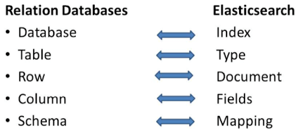
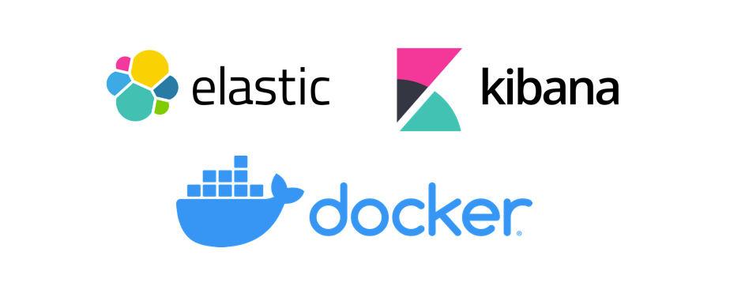
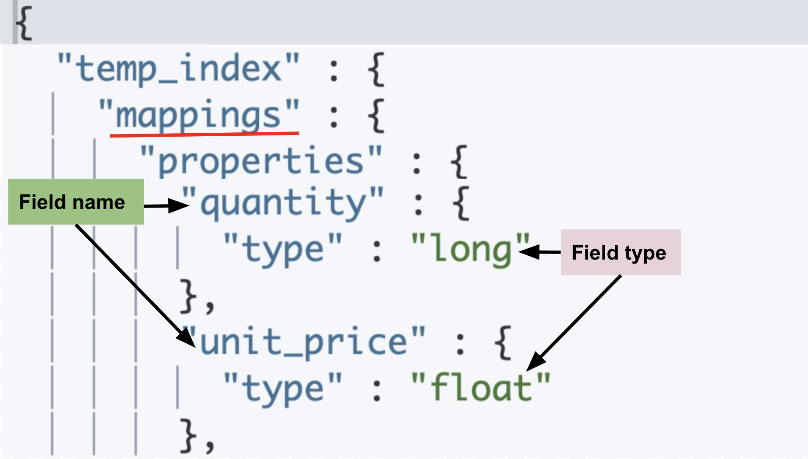

# ELK Stack Session


## **Objective**

This session aims to provide:

- Basic understanding of Elasticsearch.
- Covering fundamental concepts, architecture, and practical usage.
- Setup Elasticsearch cluster with kibana and filebeat for demonstration.

## **Key Goals**

1. Elasticsearch and Its Core Features
2. Elasticsearch Architecture Overview
3. Setting Up Elasticsearch
4. Working with Data in Elasticsearch
5. Querying and Searching in Elasticsearch
6. ELK Stack Components: Logstash and Kibana
7. Practical Use Cases of Elasticsearch

## **1. Elasticsearch and Its Core Features**

### **Introduction to Elasticsearch**

Elasticsearch is a powerful, distributed search engine designed for fast and scalable data retrieval. Built on top of Apache Lucene, it is widely used for full-text search, log analytics, and business intelligence. It supports a wide range of use cases, including website search, real-time log analysis, and application monitoring.

### **Key Features**

- **Full-Text Search**: Elasticsearch enables efficient and fast full-text search using an inverted index, allowing quick retrieval of relevant documents.
- **Scalability**: It scales horizontally by adding more nodes to a cluster, ensuring high availability, reliability, and better performance.
- **Schema-Free Document Storage**: Uses JSON-based documents, offering flexibility in data modeling without requiring predefined schemas.
- **Near Real-Time Search**: Provides low-latency indexing and search capabilities, making it ideal for real-time analytics.
- **RESTful API**: Elasticsearch exposes a RESTful API, making it easy to integrate with other applications and services using simple HTTP requests.
- **Multi-Tenancy**: Supports multiple indices within a single cluster, enabling efficient organization and isolation of data.
- **Aggregation Framework**: Allows performing complex analytics on structured and unstructured data, supporting operations like sum, average, and percentile calculations.
- **Security and Access Control**: Offers built-in authentication and role-based access control to protect sensitive data.

### **Comparison with Traditional Databases**

- Unlike relational databases (e.g., MySQL, PostgreSQL), Elasticsearch does not require predefined schemas, offering a flexible data structure.
- Optimized for high-speed read operations, whereas relational databases focus on ACID-compliant transactions.
- Elasticsearch excels in distributed architecture, ensuring high availability and fault tolerance.
- Supports complex searches and aggregations that can be difficult to achieve efficiently in traditional databases.
- While relational databases enforce strict data integrity, Elasticsearch prioritizes speed and scalability for large-scale search and analytics.



## **2. Elasticsearch Architecture Overview**

- **Nodes**: Individual instances of Elasticsearch that store data and process search requests. Nodes work together within a cluster to ensure high availability.
- **Clusters**: A collection of nodes that work together as a single system. Clusters enable scalability and redundancy.
- **Indices**: Logical namespaces that organize documents. Each index contains multiple documents related to a specific dataset.
- **Aliases**: Virtual name that can point to one or more indices. Aliases are useful for managing index versions and performing zero-downtime reindexing..
- **Shards**: Elasticsearch divides indices into smaller units called shards, allowing parallel processing and better distribution of data.
- **Replicas**: Copies of primary shards that provide fault tolerance and enhance query performance.


### **Data Distribution and Load Balancing**

- Elasticsearch automatically distributes shards across available nodes to balance the workload.
- If a node fails, replica shards ensure that data remains available and queries continue to work.
- Elasticsearch uses a master node to manage the cluster, assign shards, and maintain overall system health.

### **Role of the Inverted Index**

- The inverted index is the core structure that enables fast full-text search.
- Instead of storing documents in a sequential manner, Elasticsearch creates an index that maps words to their locations in documents.
- This approach significantly improves search performance by reducing the need to scan entire datasets.

## **3. Setting Up Elasticsearch**

- Installing Elasticsearch using Docker compose.
- Basic configuration and running Elasticsearch.
- Interacting with Elasticsearch via REST API, Kibana and Python SDK.



## **4. Working with Data in Elasticsearch**

### **Creating, Updating, and Deleting Indices**

To create an index:

```json
PUT /my_index
{
  "settings": {
    "number_of_shards": 1,
    "number_of_replicas": 1
  }
}
```

To delete an index:

```json
DELETE /my_index
```

### **Inserting and Retrieving Documents**

To insert a document:

```json
POST /my_index/_doc/1
{
  "name": "John Doe",
  "age": 30,
  "city": "New York"
}
```

To retrieve a document:

```json
GET /my_index/_doc/1
```

To update a document:

```json
POST /my_index/_update/1
{
  "doc": {
    "age": 31
  }
}
```

To delete a document:

```json
DELETE /my_index/_doc/1
```

### **Mappings and Data Types**

To define mappings while creating an index:

```json
PUT /my_index
{
  "mappings": {
    "properties": {
      "name": { "type": "text" },
      "age": { "type": "integer" },
      "city": { "type": "keyword" }
    }
  }
}
```

To view mappings of an index:

```json
GET /my_index/_mapping
```

Explanation:

- **text**: Used for full-text search fields.
- **keyword**: Used for exact match filtering and aggregations.
- **integer**: Numeric field for integer values.
- **date**: Used for date/time fields.



## **5. Querying and Searching in Elasticsearch**

- Basic search queries (Match, Term, Range, Bool queries).
- Using filters for efficient data retrieval.
- Full-text search vs. structured search.
- Aggregations for data analysis.

### **Basic Search Queries**

**Match Query** - Searches for a keyword in a text field:

```json
GET /my_index/_search
{
  "query": {
    "match": { "name": "John" }
  }
}
```

**Term Query** - Searches for an exact keyword match in a keyword field:

```json
GET /my_index/_search
{
  "query": {
    "term": { "city": "New York" }
  }
}
```

**Range Query** - Retrieves documents within a numeric range:

```json
GET /my_index/_search
{
  "query": {
    "range": {
      "age": { "gte": 25, "lte": 35 }
    }
  }
}
```

**Bool Query** - Combines multiple query types:

```json
GET /my_index/_search
{
  "query": {
    "bool": {
      "must": [ { "match": { "name": "John" } } ],
      "filter": [ { "term": { "city": "New York" } } ]
    }
  }
}
```

### **Using Filters for Efficient Data Retrieval**

Filters are used to refine search results without affecting relevance scoring:

```json
GET /my_index/_search
{
  "query": {
    "bool": {
      "filter": [ { "term": { "city": "New York" } } ]
    }
  }
}
```

### **Full-Text Search vs. Structured Search**

- **Full-Text Search**: Uses `match` queries for analyzing text.
- **Structured Search**: Uses `term`, `range`, and `filter` queries for precise lookups.

### **Aggregations for Data Analysis**

Aggregations allow performing calculations on indexed data:

```json
GET /my_index/_search
{
  "size": 0,
  "aggs": {
    "average_age": { "avg": { "field": "age" } }
  }
}
```

This aggregation computes the average age of all documents in the index.

## **6. ELK Stack Components: Logstash and Kibana**

#### **Kibana: Data Visualization and Exploration**

- **Introduction**: Kibana is a data visualization and dashboarding tool for Elasticsearch.
- **Core Features**:
  - **Discover**: Explore raw data and perform ad hoc searches.
  - **Visualizations**: Create graphs, charts, and tables based on Elasticsearch data.
  - **Dashboards**: Build interactive dashboards for real-time insights.
  - **Dev Tools**: Use the Kibana console to interact with Elasticsearch via API queries.
- **Use Cases**:
  - Creating visual reports for business intelligence.
  - Monitoring system logs and application performance.
  - Setting up alerts and anomaly detection for security and operational insights.

#### **Logstash: Data Ingestion and Processing**

- **Introduction**: Logstash is a data collection and processing engine that ingests data from various sources and sends it to Elasticsearch.
- **Pipeline Structure**:
  - **Input**: Accepts data from multiple sources (e.g., logs, databases, message queues).
  - **Filter**: Transforms and enriches data using various plugins (e.g., Grok, Mutate, GeoIP).
  - **Output**: Sends processed data to Elasticsearch, Kafka, or other storage destinations.
- **Use Cases**:
  - Collecting and normalizing log data from applications and servers.
  - Parsing structured and unstructured data before indexing in Elasticsearch.
  - Centralizing log aggregation for easier monitoring and analysis.

## **7. Practical Use Cases of Elasticsearch**

- Log and event data analysis (ELK Stack: Elasticsearch, Logstash, Kibana).
- Implementing full-text search for applications (e.g., e-commerce, document management).
- Monitoring and alerting with Elasticsearch.

## **8. Advanced Elasticsearch Features**

- Optimizing performance with proper indexing strategies.
- Security and authentication mechanisms.
- Scaling Elasticsearch clusters for high availability.

<https://www.elastic.co/docs>

## **9. Hands-on Demonstration and Exercises**

- Deploying Elasticsearch using Docker.
- Working with a sample dataset.
- Executing queries and analyzing results.
- Visualizing data in Kibana.

## **10. Q&A and Discussion**

- Addressing specific questions and challenges.
- Exploring real-world implementation scenarios.
- Best practices and troubleshooting tips.


